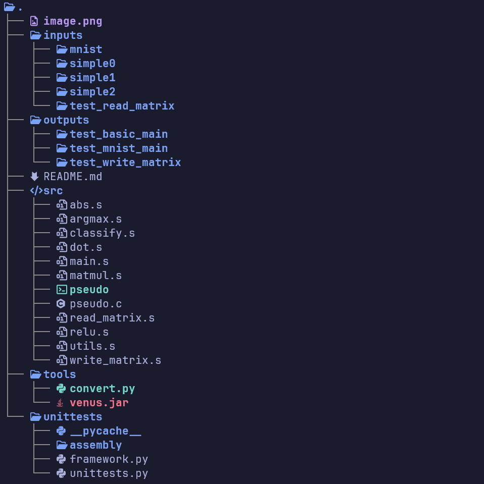

# RISC-V assembly for a simple Artificial Neural Network (ANN)

**Project Specification: <https://www.learncs.site/docs/curriculum-resource/cs61c/projects/proj2>**

This repo houses the material for UCB CS61C course Project 2: Building a classify function for a pre-trained *MNIST data set* weights. The project is split into two parts:

* Part A: Mathematical Functions: These include a **dot product**, **matrix multiplication**, an **element-wise rectifier function (ReLU)**, and an **argmax** function for vectors.

* Part B: Part B: File Operations and Main: This includes functions to read matrices from and write matrices to binary files. Then you will combine all individual functions to run a pre-trained MNIST digit classifier.

## Project Layout

## Try it out

Just for fun, you can also draw your own handwritten digits and pass them to the neural net. First, open up any basic drawing program like Microsoft Paint. Next, resize the image to 28x28 pixels, draw your digit, and save it as a .bmp file in the directory inputs/mnist/student_inputs/.

Then use the provided `bmp_to_bin.py` python script to convert your bmp to bin file. Make sure that the outputted ASCII art is kinda similar to your drawing.

> [!WARNING]
> Make sure that your bmp image is 28 x 28 and that the *bit depth* is 24 (google: microsoft paint bmp bit depth 24), otherwise the script will write garbage
